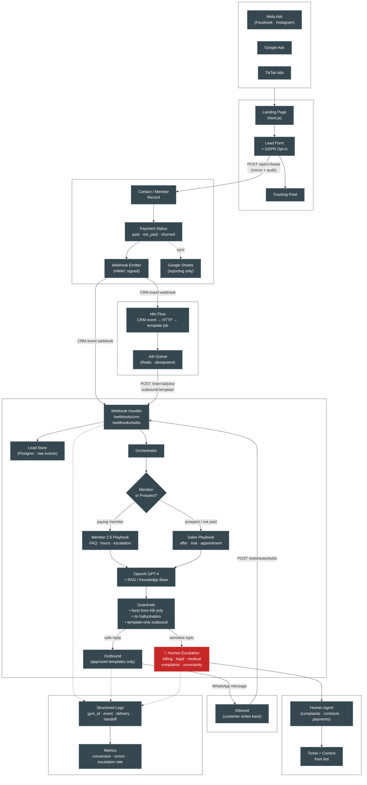
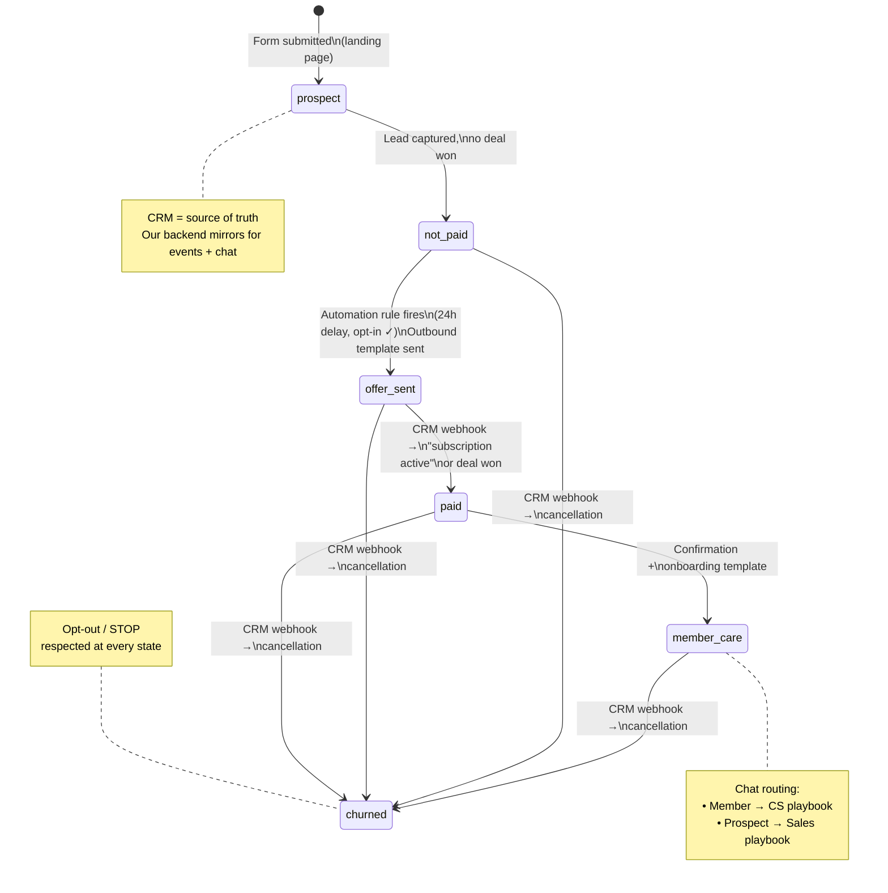
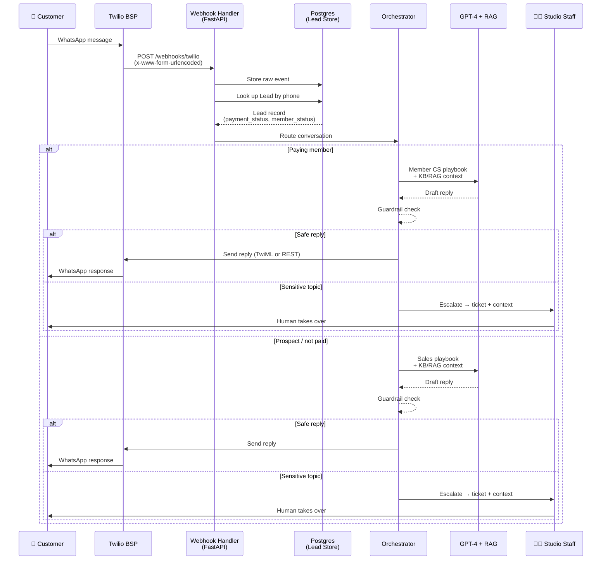
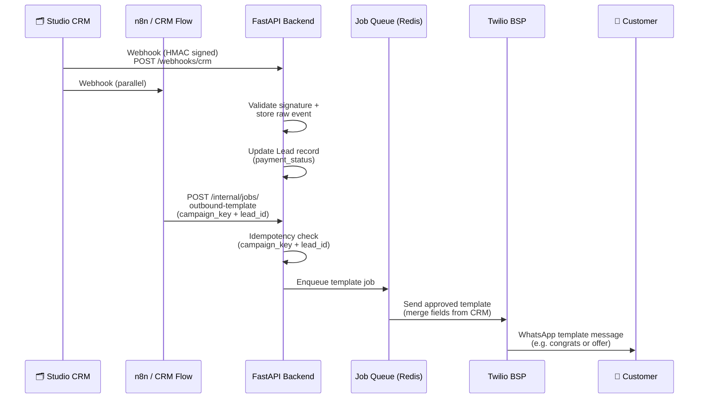
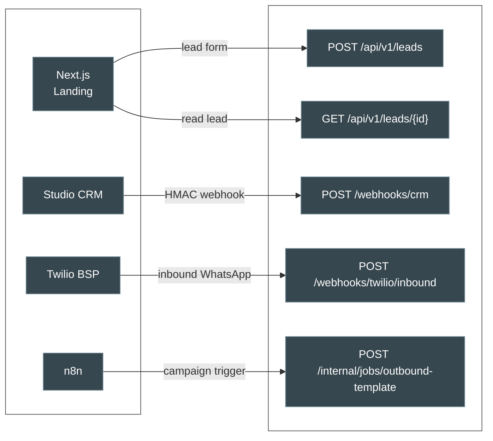

# Gym WhatsApp AI — Architecture Diagrams

> Derived from the project documentation in `docs/en/`. Designed for stakeholder presentations.
> Last updated: April 2026

---

## 1. System Architecture Overview

---

## 2. Lead Lifecycle — State Machine

---

## 3. Inbound WhatsApp — Conversation Sequence

---

## 4. Outbound Template Flow (CRM → WhatsApp)

---

## 5. Integration Points Summary

---

## GDPR & Compliance Guardrails

| Rule | Enforced Where |
|------|---------------|
| WhatsApp **opt-in** required before first promotional contact | Lead form (consent checkbox + timestamp) |
| **Approved templates only** for outbound outside 24h session | Messaging service (no freeform outbound) |
| **STOP / opt-out** respected immediately | Webhook handler → CRM sync |
| Facts from **KB/RAG** or **CRM data** only — no hallucination | AI guardrails in orchestrator |
| **Human escalation** for billing, legal, medical, complaints | Orchestrator routing rules |
| **EU hosting** for all services | Infrastructure config |
| **Data retention** limits on chat logs and webhook payloads | Deletion policy per tenant |

---

*To import into Figma/FigJam: use the **Mermaid to FigJam** plugin or paste diagrams via the Figma MCP `generate_diagram` action.*
