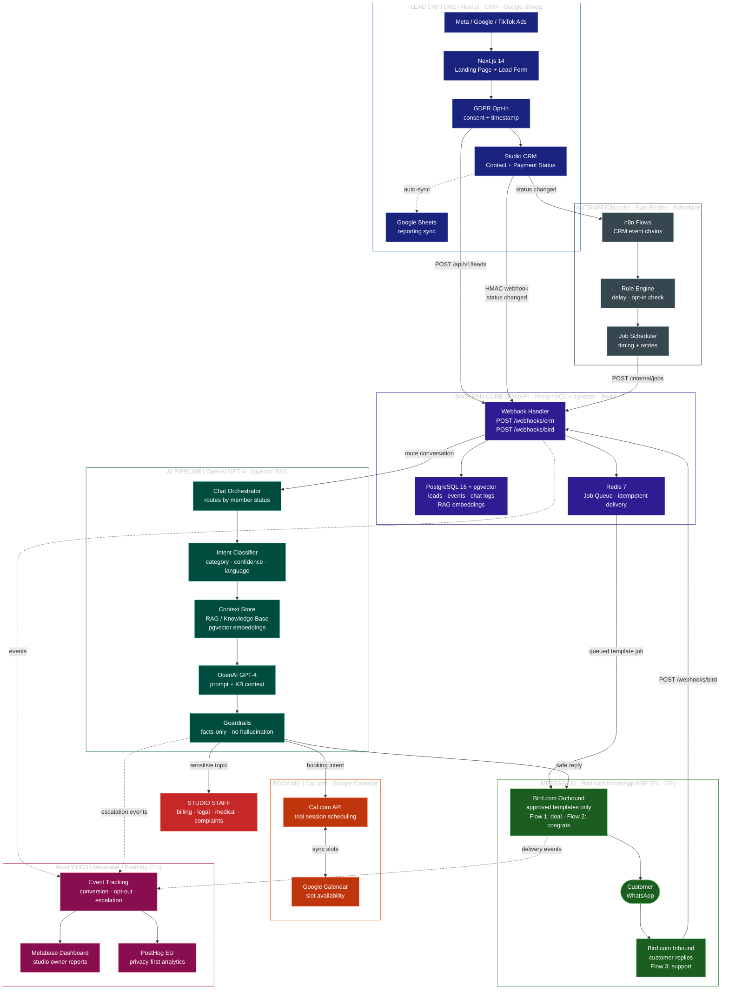

# Gym WhatsApp AI — Full Technical Architecture

> For developers, CTOs, and integration partners. Full tech stack, all data flows.
> Last updated: April 2026

---

## Full System Architecture — Technical Swimlane View

---

## What's New vs. Previous Version

| Previous | Improved |
|----------|----------|
| Twilio (US-based BSP) | **Bird.com** — EU/DE data residency, DSGVO-native |
| Implicit RAG / separate vector DB | **pgvector** on PostgreSQL 16 — no extra service |
| Raw Google Calendar API | **Cal.com** → Google Calendar — booking UI + WhatsApp links |
| Metabase only | **PostHog EU** added — privacy-first product analytics |
| Intent classification inside GPT-4 prompt | **Explicit Intent Classifier step** — gates expensive model calls |
| Monochrome flat diagram | **7 color-coded swimlanes** by domain |
| No explicit Context Store | **Context Store** (RAG) shown as a distinct pipeline step |

---

## Tech Stack

| Layer | Technology | Role |
|-------|-----------|------|
| Ads | Meta · Google · TikTok | Drive traffic to the gym landing page |
| Website | **Next.js 14** (App Router) | Landing page + lead form + tracking pixel |
| CRM | **Studio's existing CRM** | Contacts, payments, membership — we never write back |
| Reporting | **Google Sheets** | Auto-synced from CRM for the studio team |
| Backend | **FastAPI** (Python) | Webhooks, routing, rules, job dispatch |
| Database | **PostgreSQL 16 + pgvector** | Leads, events, chat logs, RAG embeddings |
| Queue | **Redis 7** | Idempotent job delivery with retries |
| AI | **OpenAI GPT-4** + pgvector RAG | Answers grounded in your knowledge base |
| Intent | **Intent Classifier** | Lightweight routing step before GPT-4 |
| WhatsApp | **Bird.com** BSP | Approved templates + inbound chat (EU hosting) |
| Booking | **Cal.com** + Google Calendar | Trial session scheduling via WhatsApp |
| Automation | **n8n** + Rule Engine | CRM event → template chains, no deploy needed |
| Analytics | **Metabase** + **PostHog EU** | Studio dashboards + privacy-first product analytics |
| Infrastructure | **Docker Compose** | Postgres + Redis + Backend in one command |

---

## Key Rules

| Rule | How it's enforced |
|------|------------------|
| GDPR / DSGVO consent before any WhatsApp | Form checkbox + timestamp stored in CRM + opt-in check in Rule Engine |
| Only approved templates for outbound | Messaging service blocks freeform outbound |
| AI never makes up facts | GPT-4 uses RAG from KB + CRM data only — Guardrails layer blocks hallucinations |
| Sensitive topics → human | Guardrails escalate billing, legal, medical, complaints to Studio Staff |
| CRM stays in charge | We listen to CRM events via HMAC-verified webhooks — never write back or override |
| Idempotent delivery | Outbound jobs keyed on `campaign_key + lead_id` — Redis queue prevents duplicates |
