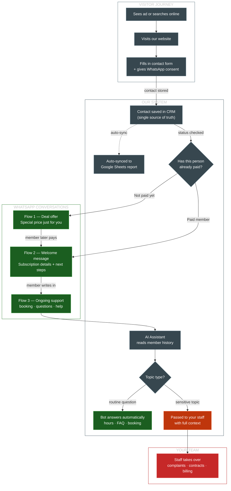

# Gym WhatsApp AI — Simplified Overview

> For studio owners, sales, marketing and partners. Simple language, no tech jargon.
> Last updated: April 2026

---

## How It All Works — The 3 Flows

---

## Tech Stack at a Glance

| Component | Technology | What it does |
|-----------|-----------|--------------|
| Website | **Next.js** (React) | Landing page with lead form + tracking |
| Backend | **FastAPI** (Python) | Receives webhooks, routes conversations, applies rules |
| Database | **PostgreSQL** | Stores leads, events, chat history |
| Job Queue | **Redis** | Reliable message delivery with retries |
| Automation | **n8n** (optional) | Simple CRM-event → template chains, editable without code |
| AI | **OpenAI GPT-4** + RAG | Answers questions using your knowledge base, not guesses |
| WhatsApp | **Twilio** (BSP) | Sends and receives WhatsApp messages (approved templates) |
| Hosting | **Docker Compose** | Runs everything together (Postgres + Redis + Backend) |
| Reporting | **Google Sheets** | Auto-synced from CRM for your team's overview |

---

## Key Promises

| What | How |
|------|-----|
| **Your CRM stays in charge** | We never replace it — we listen to it |
| **No spam** | Only people who agreed get WhatsApp messages |
| **No made-up answers** | The AI uses your texts and CRM data, not guesses |
| **Humans stay in the loop** | Complaints, billing, contracts → always your staff |
| **Google Sheets stays** | Updated by the CRM for your internal reporting |
